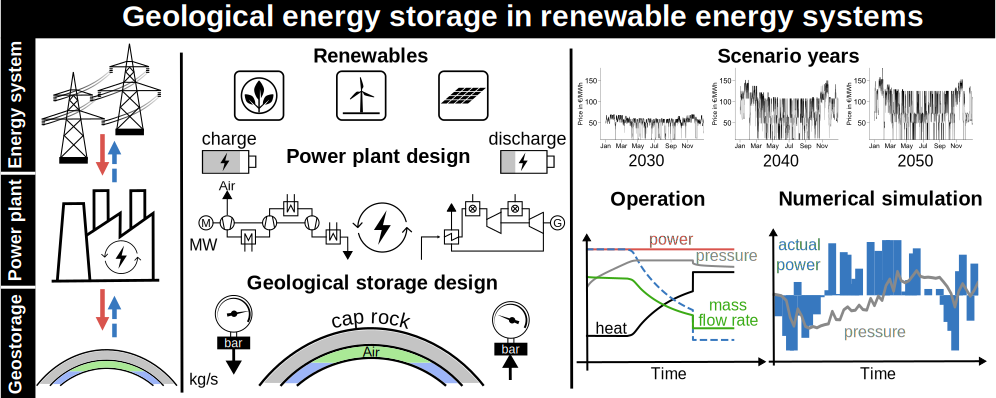

# Integrated_CASE_Assessment

Modellieren von Geoenergiesystemen

This repository contains inputs for integrated PM-CAES assessment using a set of future energy system scenarios with different fractions of renewable energy supply developed by [oemof](https://github.com/znes/angus-scenarios), as well as different technical options for the power plant topology built via [TESPy](https://github.com/oemof/tespy) and subsurface storage configurations modelled in ECLIPSE simulator.
<figure>

</figure>

## Energy system dispatch model

| Scenario year      | Power plant type |  Renewable share [%]     |  Average shadow electricity price [EUR/MWh] |  CO2 emission price [EUR/t]    |   |   |   |
|--------------------|------------------|--------------------------|---------------------------------------------|--------------------------------|---|---|---|
| 2030               |  D-CAES          |     76.3                 |          52.6                               |         29.4                   |   |   |   |
| 2040               |  D-CAES          |     85.9                 |          83.7                               |         126.0                  |   |   |   |
| 2050               |  D-CAES          |     100.0                |         88.3                                |          150.0                 |   |   |   |
| 2030               |  2-AA-CAES       |     76.3                 |          76.3                               |           -                    |   |   |   |
| 2030               |  3-AA-CAES       |     76.3                 |          76.3                               |            -                   |   |   |   |

## Surface power plant topology

  - __diabatic__ topology with 3-stage compression and 2-stage expansion stages including a heat recuperator to preheat the air from the storage 
 - __adiabatic__ plant with 2-stage compression and expansion stages
  - __adiabatic__ plant with 3-stage compression and expansion stages

<figure>

</figure>

Coupled power plant-geostorage parameters. The reference temperature and pressure are 273.15 K and 1.013 bar.

| Component            | Parameter                 | Value |
|:---------------------|:--------------------------|:------|
| Compressors          | nominal power                                                        | 230 MW  |
|                      | isentropic efficiency, *η*s,cmp                         | 0.92   |
|                      | isentropic efficiency control stage, *η*s,cmp,cs        | 0.85   |
|                      | pressure ratio stages 1 and 2 (diabatic, three-stage adiabatic)      | 5    |
|                      | pressure ratio at stage 1 (two-stage adiabatic)                  | 10   |
| Turbines             | nominal power                                                    | 115 MW |
|                      | isentropic efficiency, *η*s,exp                     | 0.90     |
|                      | isentropic efficiency control stage, *η*s,exp,cs    | 0.85   |
| Coolers              | temperature after cooling (diabatic)                             | 298.15 K |
|                      | temperature after cooling (adiabatic)                            | 338.15 K     |
| Generator & Motor    | efficiency, *η*(el,mech)                              | 0.97   |
| Combustion           | fuel type (diabatic)                                             | CH4   |
|                      | turbine inlet temperature                                        | 1473.15 K   |
|                      | outlet temperature (diabatic)                                    | 423.15 K   |
|                      | pressure loss                                                    | 3 %    |
| Heat exchangers      | temperature after reheating (adiabatic)                          | 573.15 K |
|                      | pressure loss                                                    | 2 %     |
| Storage              | nominal pressure compression                                     | 115 bar   |
|                      | nominal pressure expansion                                       | 110 bar    |
|                      | vertical well length, *L*                                        | 1055 m     |
|                      | vertical well number                                             | 9 / 3     |
|                      | pipe roughness, *k*s                                  | 0.04 mm     |
|                      | well diameter, *D*                                              | 0.25 m     |
|                      | horizontal well number                                           | 2 / 2     |
|                      | horizontal section length, *L*h                       | 450 m / 850 m     |
|                      | total completion length,                                         | 150 m / 150 m     |

### Plant performance

<figure>

</figure>

*Power plant performance during continuous charging (top row: a, b, c) and discharging (bottom row: d, e, f) runs*

## Subsurface storage settings

Main geostorage parameters for scenario simulation.

| Parameter     | Value                                                            |
|---------------|--------------------------------------------------------------------|
Dry air composition  |N2/O2/Ar/CO2 (0.7553/0.2314/0.0129/0.0004)
Molar mass of air  |                                        28.965 g/mol
Critical temperature  |                                     132.53 K
Critical pressure  |                                        37.86 bar
Air density at standard condition  |                        1.205 kg/m3
Initial pressure gradient  |                                0.105 bar/m
Reservoir temperature (isothermal)  |                       311 K
Permeability  |                                             700 mD
Porosity  |                                                 0.27
Residual water saturation  |                                0.15
Residual gas saturation  |                                  0
Max. relative gas permeability  |                           0.9
Max. relative water permeability  |                         1
Capillary entry pressure  |                                 0.1 bar
Pore size distribution index  |                             2
Initial air in place mass  |                                5.56 Mt
Maximum/minimum allowable BHP  |                            130 / 80 bar

<figure>

</figure>

*Geostorage configuration schemes (top row: abc) and simulation results (bottom row: def)*

## Reference
- Gasanzade, F., Witte, F., Tuschy, I. and Bauer, S., 2023. Integration of geological compressed air energy storage into future energy supply systems dominated by renewable power sources. Energy Conversion and Management, 277, __doi:10.1016/j.enconman.2022.116643__ 
- TESPy Version 0.4.2 - User's Universe, __doi:10.5281/zenodo.4534878__
- National scale energy system scenarios, __doi:10.5281/zenodo.3714708__
- ECLIPSE Reservoir Simulation Software v2017.2, Schlumberger Ltd.
